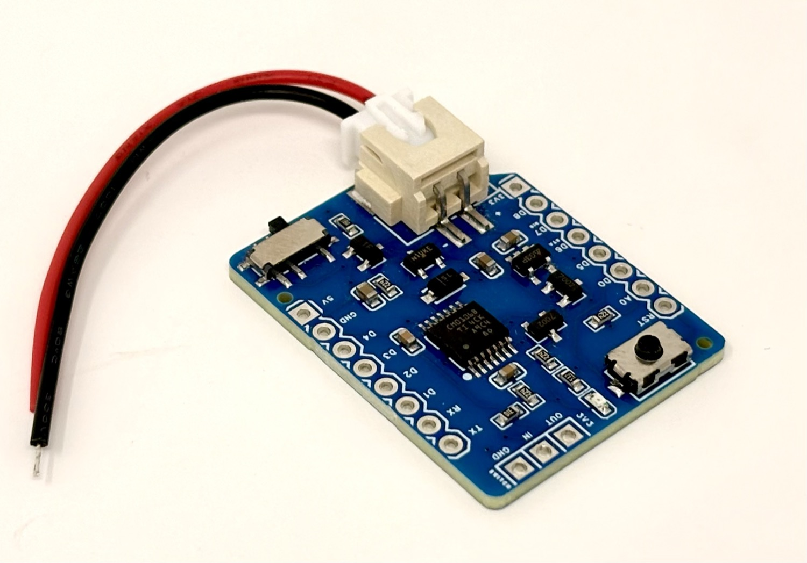
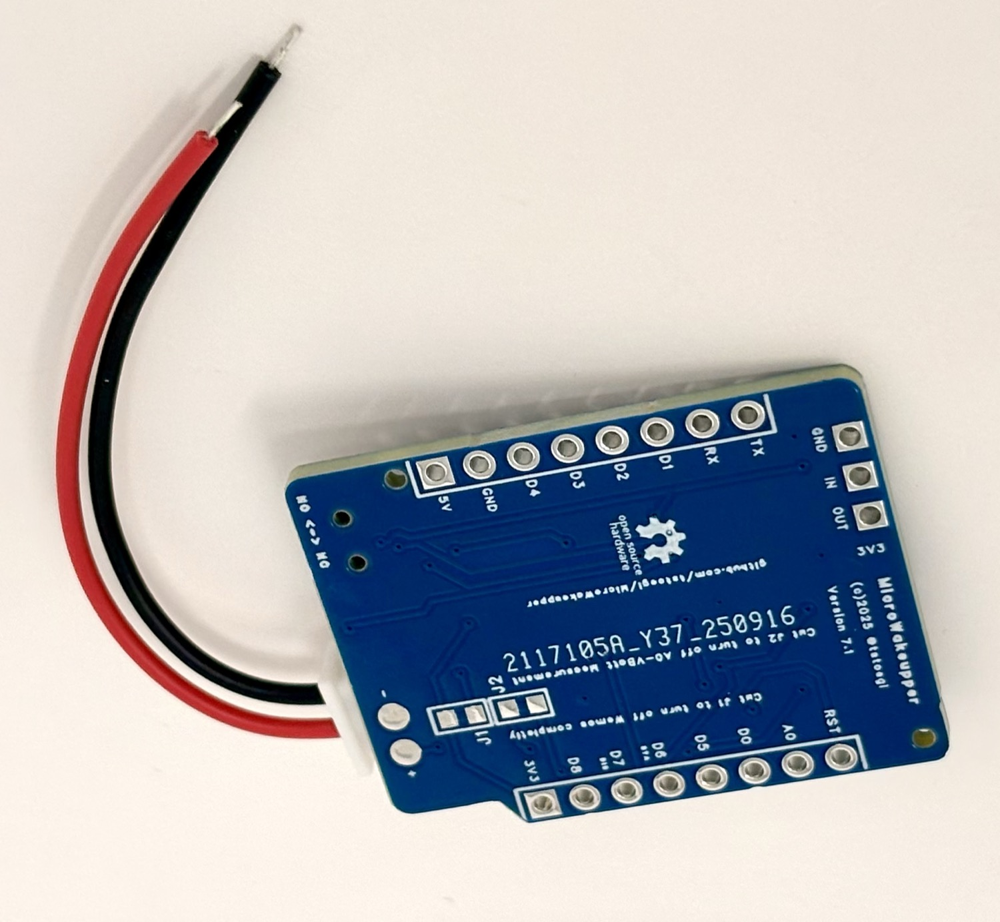

# MicroWakeupper

[](https://www.arduino.cc/reference/en/libraries/microwakeupper-wemos-d1-mini-battery-shield/)
[](https://github.com/tstoegi/MicroWakeupper/releases)
[](LICENSE)
[](https://www.oshwa.org/)

**A battery-powered wake-up shield for Wemos D1 Mini (ESP8266) that triggers from external events like buttons, switches, or PIR sensors.**

<p align="center">
  
  
</p>

---

## Features

- **External Wake-up** - Wake ESP8266 from deep sleep via button, switch, or PIR sensor
- **Ultra-low Power** - As low as 7uA standby current (with J1 & J2 cut)
- **Flexible Power** - 2.5V to 6V input (4xAA, 3.7V LiPo, etc.)
- **NO/NC Support** - Works with normally open or normally closed switches
- **Battery Monitoring** - Built-in voltage divider on A0 for VBatt measurement
- **Debouncing** - Hardware-based button debouncing and retrigger protection
- **Plug & Play** - Stacks directly on Wemos D1 Mini

---

## Current Consumption

| Configuration | Current | Notes |
|--------------|---------|-------|
| Default (J1 uncut) | ~254 uA | Wemos in deep sleep |
| J1 cut | ~55 uA | Wemos completely off |
| J1 + J2 cut | ~7 uA | No VBatt measurement |

*Measured at VBatt 3.7V*

---

## Installation

### Arduino Library Manager (Recommended)

1. Open Arduino IDE
2. Go to **Sketch** > **Include Library** > **Manage Libraries...**
3. Search for `MicroWakeupper`
4. Click **Install**

### Manual Installation

```bash
cd ~/Arduino/libraries
git clone https://github.com/tstoegi/MicroWakeupper.git
```

---

## Quick Start

```cpp
#include <MicroWakeupper.h>

MicroWakeupper mw;

void setup() {
    Serial.begin(115200);
    mw.begin();

    if (mw.resetedBySwitch()) {
        Serial.println("Woke up from external trigger!");
    } else {
        Serial.println("Woke up from deep sleep timer");
    }

    // Read battery voltage
    float vbatt = mw.readVBatt();
    Serial.printf("Battery: %.2fV\n", vbatt);

    // Do your work here...

    // Re-enable triggering and go back to sleep
    mw.reenable();
    ESP.deepSleep(60e6); // Sleep for 60 seconds
}

void loop() {
    // Not reached when using deep sleep
}
```

---

## API Reference

### Constructor

```cpp
MicroWakeupper mw(bool disableAtStartup = true, int staPin = D6, int disPin = D7);
```

### Methods

| Method | Description |
|--------|-------------|
| `begin()` | Initialize GPIO pins |
| `resetedBySwitch()` | Returns `true` if woken by external trigger |
| `reenable()` | Re-arm for new triggers (2-3 sec hardware delay) |
| `disable()` | Prevent new triggers |
| `isEnabled()` | Check if ready for new triggers |
| `isActive()` | Check if currently triggered (LED on) |
| `readVBatt()` | Read battery voltage via A0 |
| `setVoltageDivider(float)` | Adjust voltage divider constant (default: 187) |

---

## Hardware

### Pin Assignments

| Pin | Function |
|-----|----------|
| D6 | Status (STA) - trigger detection |
| D7 | Disable (DIS) - control triggering |
| A0 | Battery voltage measurement |

### Jumpers

- **J1** - Cut to completely power off Wemos (no deep sleep)
- **J2** - Cut to disable VBatt measurement (saves ~48uA)

### Schematic & Gerber Files

All hardware design files are available in the [`/pcb`](./pcb) directory.

---

## Where to Buy

The assembled MicroWakeupper shield is available on Tindie:

[](https://www.tindie.com/stores/moreiolabs/)

---

## Example Projects

- [MyMeter](https://github.com/tstoegi/MyMeter) - Gas/Water meter reading with MicroWakeupper

---

## License

This project is open source hardware and software. See [LICENSE](LICENSE) for details.

---

## Acknowledgments

Special thanks to [@davedarko](https://github.com/davedarko) for inspiration and support!

---

## Revision History

| Version | Date | Author |
|---------|------|--------|
| R7.1 | Jan 30, 2026 | Tobias Stoeger |
| R6.3 | Feb 3, 2022 | Tobias Stoeger |
| R6.2 | May 28, 2021 | Tobias Stoeger |
| R6 | May 20, 2021 | Tobias Stoeger |
| R3 | Jan 7, 2019 | Tobias Stoeger |
| R1 | Dec 13, 2018 | Tobias Stoeger |

---

<p align="center">
  Made with care by <a href="https://twitter.com/tstoegi">@tstoegi</a>
</p>
