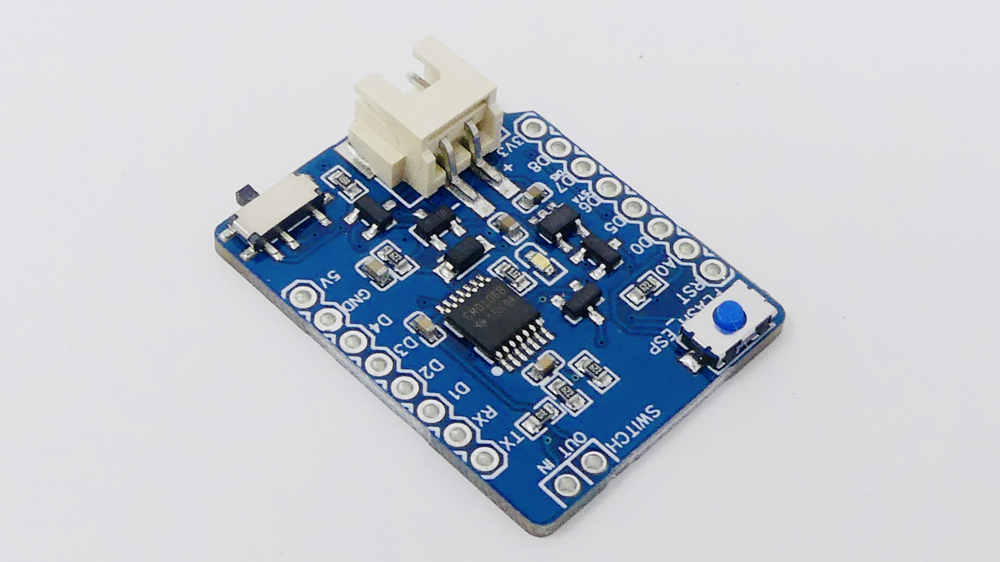

**What is it?**

You need the MicroWakeupper Battery Shield if you want to wakeup or power on your ESP/Wemos due to an external event (e.g. a switch, button or PIR-sensor). As soon as there is an external event the MicroWakeupper wakes up your ESP/Wemos from deep sleep or just turns it on. Pin A0 is connected - can be disconnected - to V-Batt for measuring the current battery voltage.
The MicroWakeupper and your ESP/Wemos is powered by a standard (protected) LiPo battery (XH-Header). The internal LDO (AP2112K) will take care about the 3.3V voltage supply.

**Why did I make it?**

The MicroWakeupper will run your projects on battery for years. Your ESP/Wemos will only wakeup or turn on (and consume current) if the connected switch, button or PIR sensor was toggled/triggered. During the rest of the time the ESP is in deep sleep mode or (optionally - J2 cut) completely off.

**Current consumption**

Default - uncut Jumper J1 (Wemos in DeepSleep): ~254uA (0,254mA)

Cut Jumper J1 (Wemos turned off - no DeepSleep): ~55uA (0,055mA)

If you don't need VBatt measurement (J2 cut) you can reduce current: ~7uA (0,007mA)

(Measurement done at VBatt 3,7V)

Feel free to desolder the on board LED ;-)

**What makes it special?**

The MicroWakeupper is the plug and play solution if you want to add a button, switch or PIR sensor to your project. The board supports two switching modes for normally open or normally closed behaviour. It also takes care about retriggering and button debouncing.

For more information and the microWakeupper-Arduino Library please check: https://github.com/tstoegi/MicroWakeupper
(...and follow me on twitter @tstoegi)

This is NO kit - the MicroWakeupper board comes fully assembled (without headers and Wemos D1 mini).

Looking forward to get feedback about your awesome MicroWakeupper projects!

Tobias

# The latest board revision is available on tindie:
https://www.tindie.com/stores/moreiolabs/

---
# You'll always find the latest schematic, BOM and Gerber files on GitHub:

[./pcb](./pcb)

---

That's it!

Have fun and hopefully your project will run for years now ;-)

#Special thanks to @davedarko!
+ Created on December 13th 2018 by Tobias Stöger (@tstoegi)  
+ Updated to Rev.3 on January 7th 2019 by Tobias Stöger
+ Updated to Rev.6 on May 20th 2021 by Tobias Stöger
+ Updated to Rev.6.2 on May 28th 2021 by Tobias Stöger
+ Updated to Rev.6.3 on Feb 3rd 2022 by Tobias Stöger
